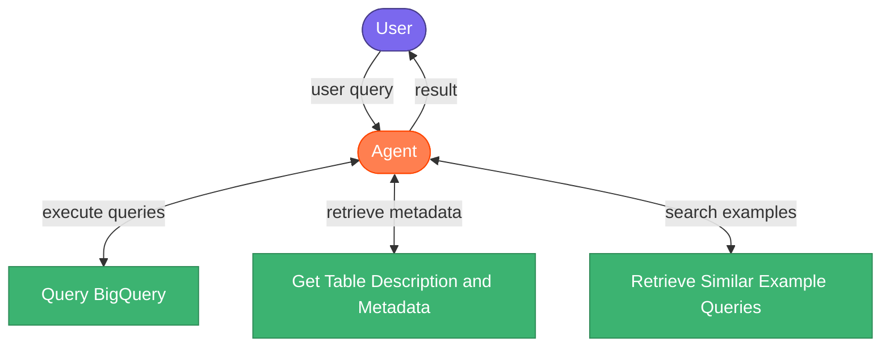

# Mimic-Agent

A friendly SQL agent that can run queries and answer questions using Mimic-iii clinical data.  
[Blog post](https://yonigottesman.github.io/2025/04/14/mimicagent.html)


Hosted Version: [https://mimic-agent.yonigo.co/](https://mimic-agent.yonigo.co/)

## Run Template App
```
export ANTHROPIC_API_KEY=<anthropic_key>
uv run python app/agent_template.py
```


## Build Docker
```
docker build -f Dockerfile -t mimic-agent .
```

# Run Docker Locally
```
docker run -p 8501:8080 \
-v /path/to/your/application_default_credentials.json:/app/credentials.json \
-e GOOGLE_APPLICATION_CREDENTIALS=/app/credentials.json \
-e ANTHROPIC_API_KEY=<anthropic_key> \
-e GCLOUD_PROJECT_ID=<gcloud_project_id> \
mimic-agent
```

# Deploy to Cloud Run
```
gcloud run deploy mimic-agent \
--source . \
--update-env-vars ANTHROPIC_API_KEY=<anthropic_key>,GCLOUD_PROJECT_ID=<gcloud_project_id> \
--min-instances 0 \
--region europe-west1 \
--allow-unauthenticated \
--memory 4Gi \
--cpu 4000m
```
